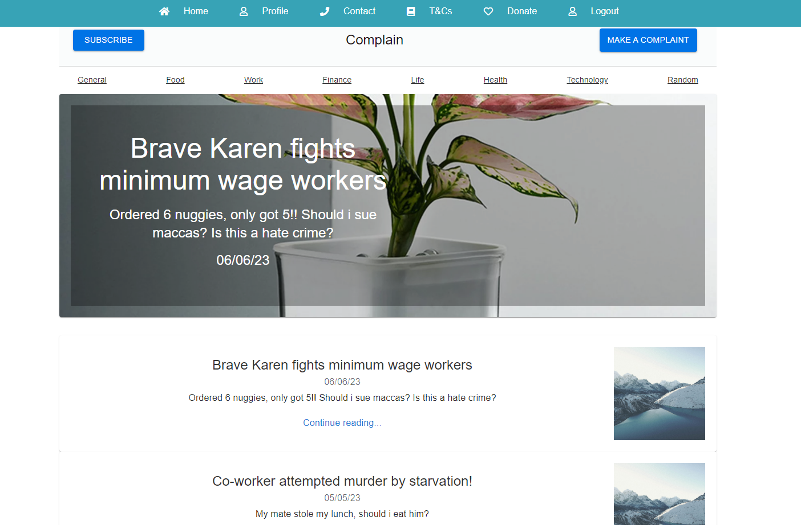
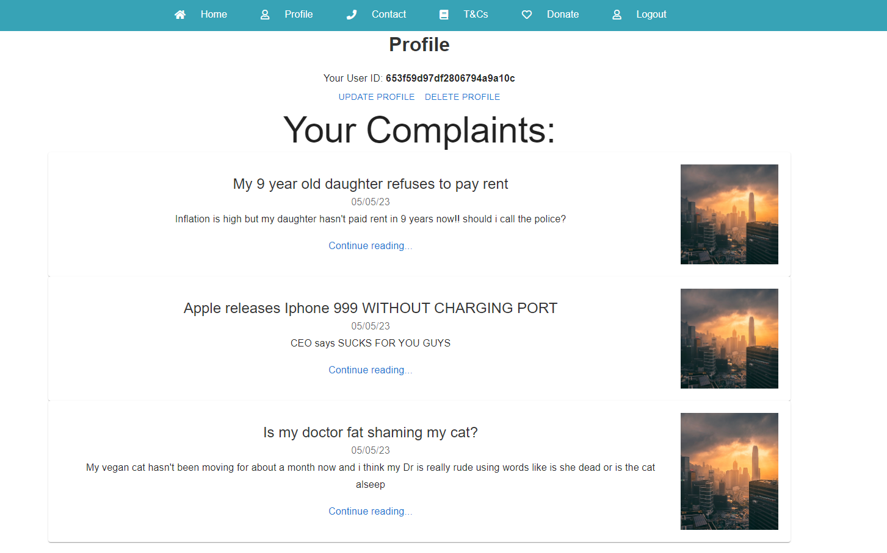
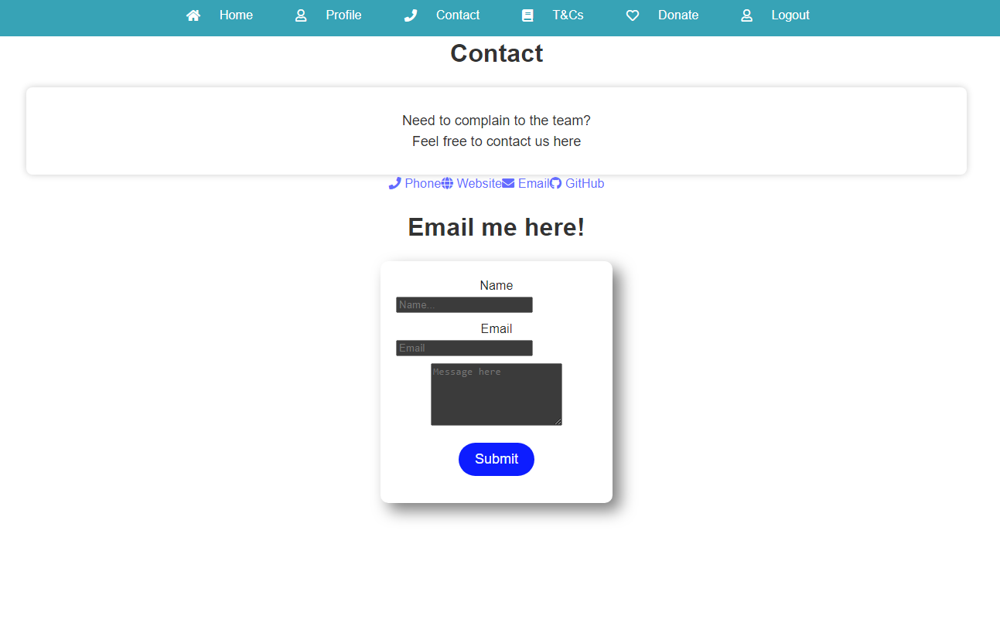
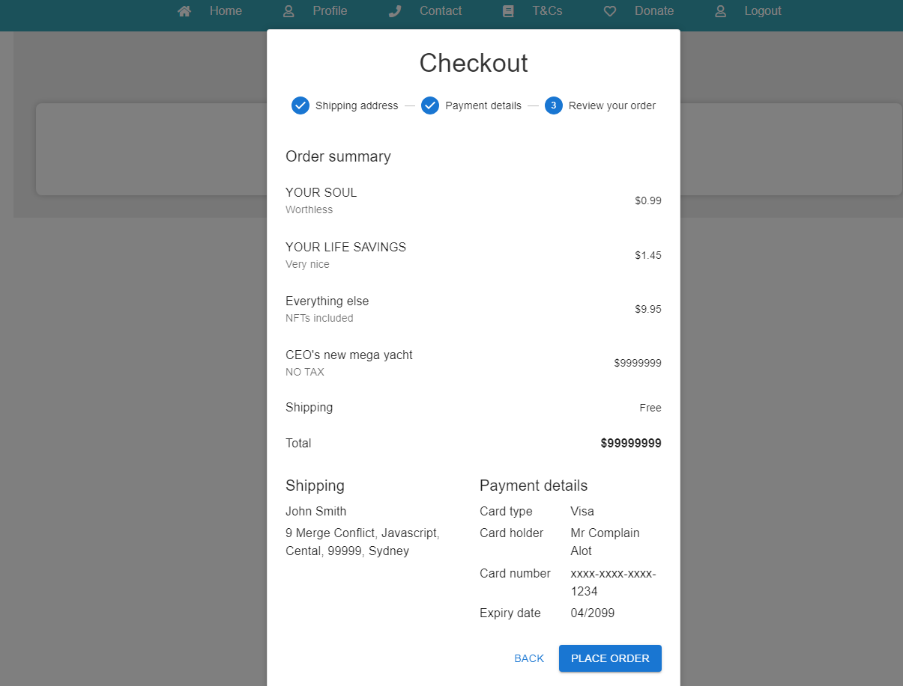

# Complain
https://your-complaint-b9ee4991068a.herokuapp.com/


   
## 📄 Description
Complain.com: Empowering Voices, Amplifying Concerns

Complain.com is a dynamic and user-friendly full-stack web application designed to give voice to individuals' concerns and complaints. Built with the cutting-edge MERN stack (MongoDB, Express, React, Node.js), Complain.com offers a seamless experience for users to share, engage, and connect over various issues.

Key Features:

User Authentication: Complain.com provides a secure platform with user authentication, allowing individuals to sign up, sign in, and personalize their profiles.

Complaint Creation and Management: Users can create, edit, and delete their own posts effortlessly. This feature ensures complete control over the content they share.

Interactive Community: Complain.com fosters an interactive community where users can view, comment, and vote on other complaints. Upvotes and downvotes enable users to express agreement or disagreement, shaping the visibility of posts.

Featured Posts: The platform showcases the top-voted posts as featured complaints on the homepage, giving prominence to issues that resonate most with the community.

Rich Multimedia Support: Complain.com allows users to enrich their posts by uploading images, enhancing the storytelling experience. The image upload feature is user-friendly, utilizing file readers to save images efficiently.

Email Component: The contact page features an email component powered by email.js, providing a direct channel for users to communicate concerns. The component is styled with Semantic UI/CSS and incorporates SweetAlert for alerts, ensuring seamless communication.

Sleek UI/UX: Complain.com boasts an intuitive and visually appealing user interface, rendered using React and styled with Material-UI, Styled Components, and Emotion Styled. The design emphasizes a smooth user experience, enhancing engagement and navigation.

Technology Stack:

Frontend: React.js, Material-UI, Styled Components, Emotion Styled
Backend: Node.js, Express.js, GraphQL
Database: MongoDB, Mongoose ODM
Authentication: Bcrypt
Email Handling: email.js, Semantic UI/CSS, SweetAlert
Image Handling: File Reader (Base-64 image storage)

Complain.com stands as a testament to the power of technology in amplifying individual voices. With its intuitive interface, robust features, and engaging community, it empowers users to raise their concerns, foster discussions, and drive positive change.
Join Complain.com today and make your voice heard.

## 🪛 Technologies used
<p><a href="https://nodejs.org/">Node.js</a></p>
<p><a href="https://www.npmjs.com/">NPM</a></p>
<p><a href="https://www.npmjs.com/package/express">Express.js</a></p>
<p><a href="https://www.npmjs.com/package/dotenv">dotenv</a></p>
<p><a href="https://heroku.com/">Heroku</a></p>
<p><a href="https://www.apollographql.com/docs/react/">Apollo Client</a></p>
<p><a href="https://www.apollographql.com/docs/apollo-server/">Apollo Server</a></p>
<p><a href="https://www.apollographql.com/docs/react/api/react-upload-client/">Apollo Upload Client</a></p>
<p><a href="https://www.npmjs.com/package/bcrypt">Bcrypt</a></p>
<p><a href="https://www.npmjs.com/package/base-64">Base-64</a></p>
<p><a href="https://getbootstrap.com/">Bootstrap</a></p>
<p><a href="https://www.npmjs.com/package/concurrently">Concurrently</a></p>
<p><a href="https://emotion.sh/docs/introduction">Emotion React</a></p>
<p><a href="https://emotion.sh/docs/styled">Emotion Styled</a></p>
<p><a href="https://www.emailjs.com/">EmailJS</a></p>
<p><a href="https://www.emailjs.com/">EmailJS-Com</a></p>
<p><a href="https://expressjs.com/">Express</a></p>
<p><a href="https://fontawesome.com/">Font Awesome Free</a></p>
<p><a href="https://graphql.org/">GraphQL</a></p>
<p><a href="https://happy.dom/">Happy-DOM</a></p>
<p><a href="https://www.npmjs.com/package/js-base64">JS Base-64</a></p>
<p><a href="https://www.npmjs.com/package/jwt-decode">JWT Decode</a></p>
<p><a href="https://www.npmjs.com/package/jsonwebtoken">Jsonwebtoken</a></p>
<p><a href="https://www.mongodb.com/">MongoDB</a></p>
<p><a href="https://mongoosejs.com/">Mongoose</a></p>
<p><a href="https://reactjs.org/">React</a></p>
<p><a href="https://react-bootstrap.github.io/">React Bootstrap</a></p>
<p><a href="https://reactjs.org/docs/react-dom.html">React DOM</a></p>
<p><a href="https://reactdatepicker.com/">React Datepicker</a></p>
<p><a href="https://react-dropzone.js.org/">React Dropzone</a></p>
<p><a href="https://react-icons.github.io/react-icons/">React FontAwesome</a></p>
<p><a href="https://react-icons.github.io/react-icons/">React Icons</a></p>
<p><a href="https://reactrouter.com/">React Router DOM</a></p>
<p><a href="https://semantic-ui.com/">Semantic UI CSS</a></p>
<p><a href="https://react.semantic-ui.com/">Semantic UI React</a></p>
<p><a href="https://stripe.com/">Stripe</a></p>
<p><a href="https://sweetalert2.github.io/">SweetAlert2</a></p>
<p><a href="https://testing-library.com/docs/react-testing-library/intro/">Testing Library React</a></p>
<p><a href="https://vitejs.dev/">Vitest</a></p>
 
## 📓 Table of Contents
- [Complain](#complain)
  - [📄 Description](#-description)
  - [🪛 Technologies used](#-technologies-used)
  - [📓 Table of Contents](#-table-of-contents)
  - [🖥️ Installation](#️-installation)
  - [💬 Usage](#-usage)
  - [🖼️ Screenshot](#️-screenshot)
  - [📹 Video](#-video)
  - [⚖️ License](#️-license)
  - [🤝 Contributing](#-contributing)
  - [🛠️ Tests](#️-tests)
  - [❔ Questions](#-questions)
   
## 🖥️ Installation

You can use our deployed link

https://your-complaint-b9ee4991068a.herokuapp.com/

or you can do a ```git clone```


To install our dependencies run
 ```npm install```

run this command to seed the database

```npm run seed```

and finally run 

```npm run develop```

to start the local host server and graphQL apollo server

 
## 💬 Usage
Users can utlise Complain.com to sign up, sign in, log in or log out
Users can make a new complaint/post as well as add comments to other posts and upvote or downvote posts.
The highest rated posts will appear as a featured posts on the homepage.

## 🖼️ Screenshot

Homepage


Profile 


Contact
Emailjs will send emails to Brian.trang9@gmail.com


Donate


## 📹 Video
Complain gif


## ⚖️ License
This project is licensed under MIT
 
## 🤝 Contributing
Brian Trang
Jarrod Blanning
Kalid Nadere
 
## 🛠️ Tests
N/A
 
## ❔ Questions
If you have any questions about this project, please contact me directly at brian.trang9@gmail.com. Feel free to view more of my projects at https://github.com/MakeRedundant.